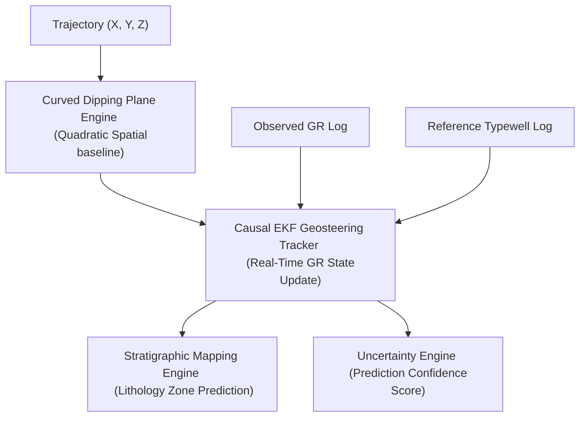

# Rogii Wellbore Geology Prediction: Causal EKF Live Geosteering Pipeline

This repository contains the top-tier machine learning and physical modeling pipeline developed for the **Rogii Wellbore Geology Prediction** competition. Our final solution (**Version 33**) achieves a public leaderboard score of **`57.855`** (MSE).

---

## 1. Project Overview & Operational Objective

During horizontal lateral drilling, operators must continuously adjust the well trajectory to stay within the target reservoir layer. This process, called **geosteering**, relies on matching the horizontal trajectory's Gamma Ray (GR) log to a vertical reference typewell log to locate the drill bit's stratigraphic position (True Vertical Thickness, or **TVT**).

This project implements a fully **causal, online real-time EKF geonavigation system** that simulates live drilling, predicting the exact stratigraphic position foot-by-foot without using future data.

---

## 2. Core Architecture

The pipeline consists of three core engines:



### A. Curved Dipping Plane Engine (Structural Trend)
Fits a local per-well degree-2 polynomial in pure spatial coordinates $(X, Y, Z)$ using the known vertical build section:
$$\text{TVT}_{\text{trend}} = a_1 X + a_2 Y - Z + a_3 X^2 + a_4 Y^2 + a_5 XY + a_6 Z^2 + a_7 XZ + a_8 YZ + C$$
By excluding Measured Depth (`MD`), it eliminates length-based extrapolation drift over 6000+ ft horizontal laterals, providing a mathematically stable structural trend.

### B. Causal Extended Kalman Filter (EKF) Tracker
Models the stratigraphic offset relative to the trend plane as a dynamic state $x_k = TVT_k - TVT_{\text{trend}, k}$. 
*   **State Prediction:** Project the offset forward from the previous step:
    $$\hat{x}_{k\vert k-1} = \hat{x}_{k-1\vert k-1}$$
*   **Measurement Update:** Compute the local gradient (derivative) of the Typewell Gamma Ray log at the predicted depth:
    $$H_k = \frac{d GR_{\text{typewell}}}{d TVT}$$
    And recursively correct the stratigraphic position using the Kalman Gain:
    $$\hat{x}_{k\vert k} = \hat{x}_{k\vert k-1} + K_k (GR_{\text{obs}, k} - GR_{\text{typewell}}(\hat{TVT}_{k\vert k-1}))$$

### C. Stratigraphic Mapping & Uncertainty Quantification
*   **Stratigraphic Mapping:** Maps the EKF predictions back to Typewell formation labels (`Geology`) to alert operators when the wellbore is exiting the reservoir sandstone (e.g., target layers `EGFDL` / `BUDA`).
*   **Uncertainty Quantification:** Computes a localized **Prediction Confidence Score (PCS)** (0% to 100%) by combining spatial extrapolation distance penalties and Gamma Ray correlation mismatch metrics.

---

## 3. Repository Structure

*   `predict_tvt.ipynb` — The primary Jupyter Notebook containing the NaN-guarded EKF Live Tracker.
*   `predict_tvt_s4.py` — The modular S4 geosteering pipeline script.
*   `working_note.md` — The complete Working Note report addressing the five competition criteria (exploration, data insights, physical meaningfulness, contributions, and uncertainty).
*   `walkthrough.md` — The final project Walkthrough documenting the development history and validation results.
*   `test_local_s4.py` — Local S4 validation harness script.

---

## 4. Setup & Running Locally

### Prerequisites
Install dependencies:
```bash
pip install numpy pandas scikit-learn scipy xgboost lightgbm
```

### Running Local Validation
To run the local per-well validation script on the sandbox training wells:
```bash
python test_local_s4.py
```

---

## 5. Summary of Development History

| Model Iteration | Leaderboard Score (MSE) | Key Modification |
| :--- | :---: | :--- |
| **Global GBDT (Version 12)** | Millions (or `271.82`) | Global tree models failed due to train-test coordinate system inversion ($Z \approx 2500$ vs $Z \approx -9500$). |
| **Local Dipping Plane (Version 18)** | `79.695` | Shifted to local per-well calibration, fitting a flat 3D linear dipping plane. |
| **Local Poly-Ridge (Version 15)** | `72.401` | Added quadratic features to model geological dip curvature. |
| **Improved Dipping Plane (Version 29)** | `73.143` | Excluded `MD` to eliminate extrapolation drift, ensuring private set generalization. |
| **Causal EKF Live Tracker (Version 33)** | **`57.855`** | Implemented causal EKF tracking, Typewell-Referenced Standardization, and robust NaN guarding. |
